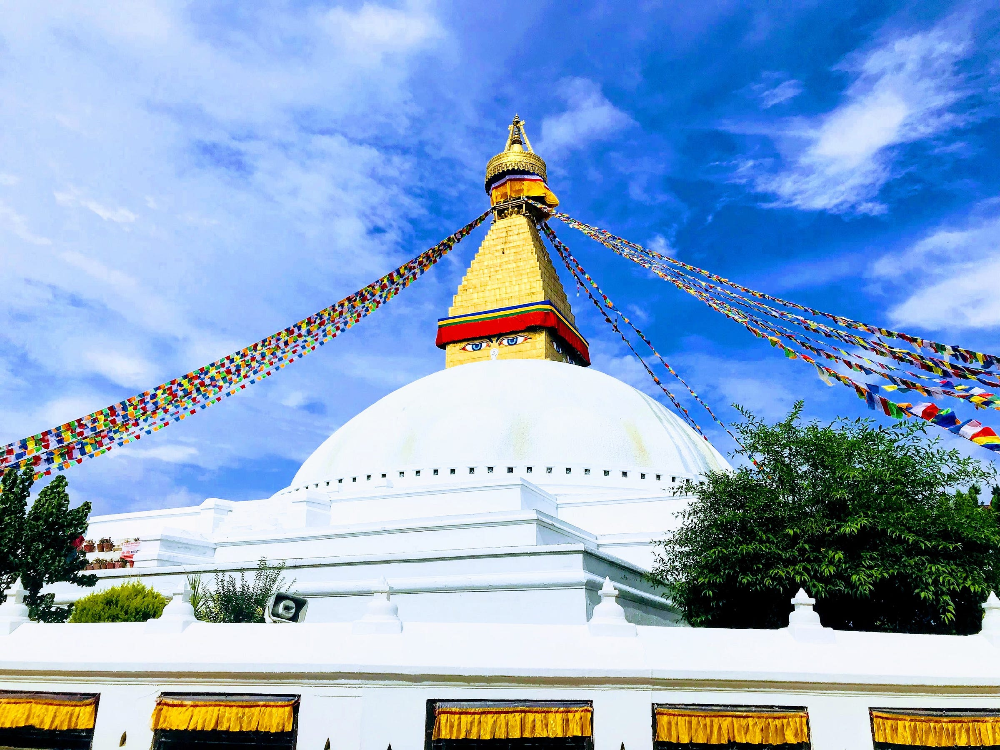
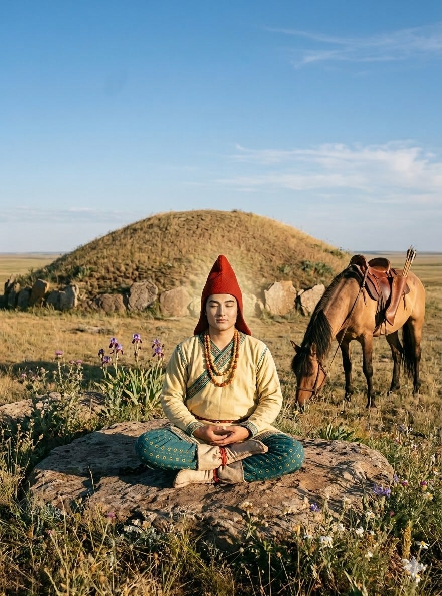
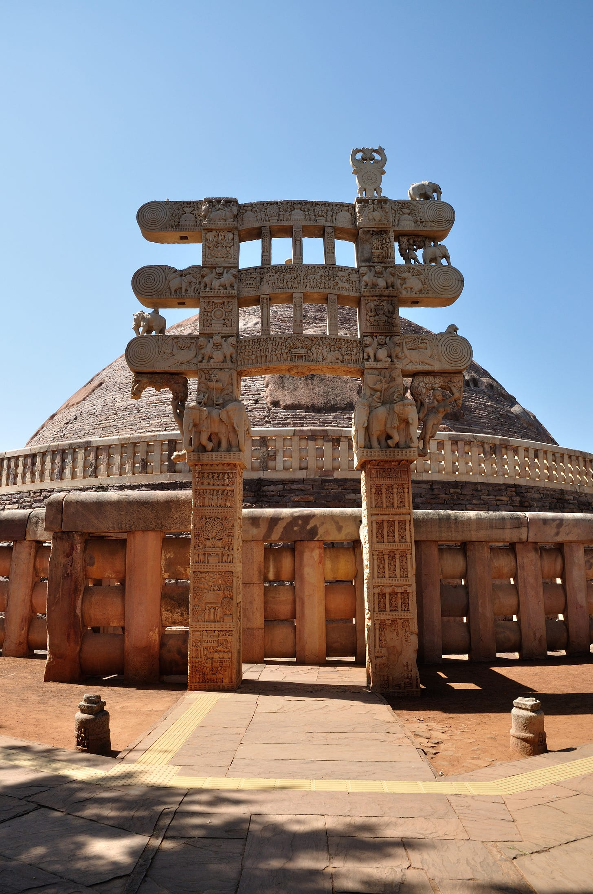
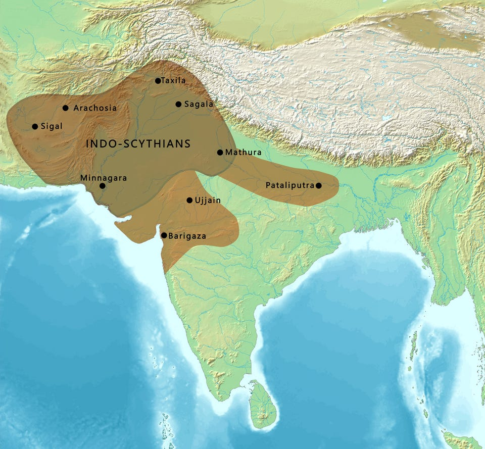
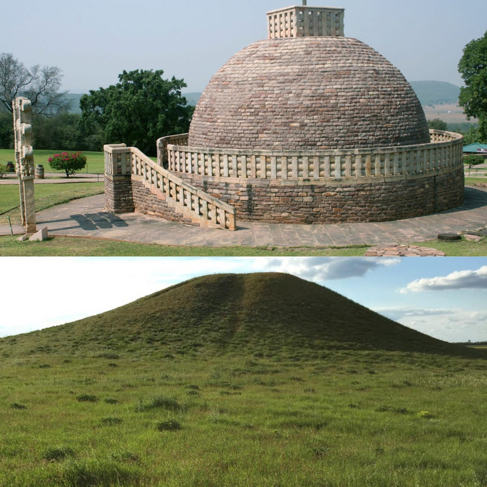
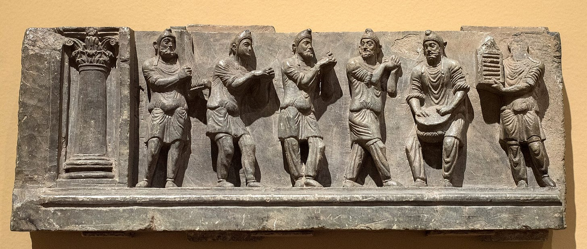
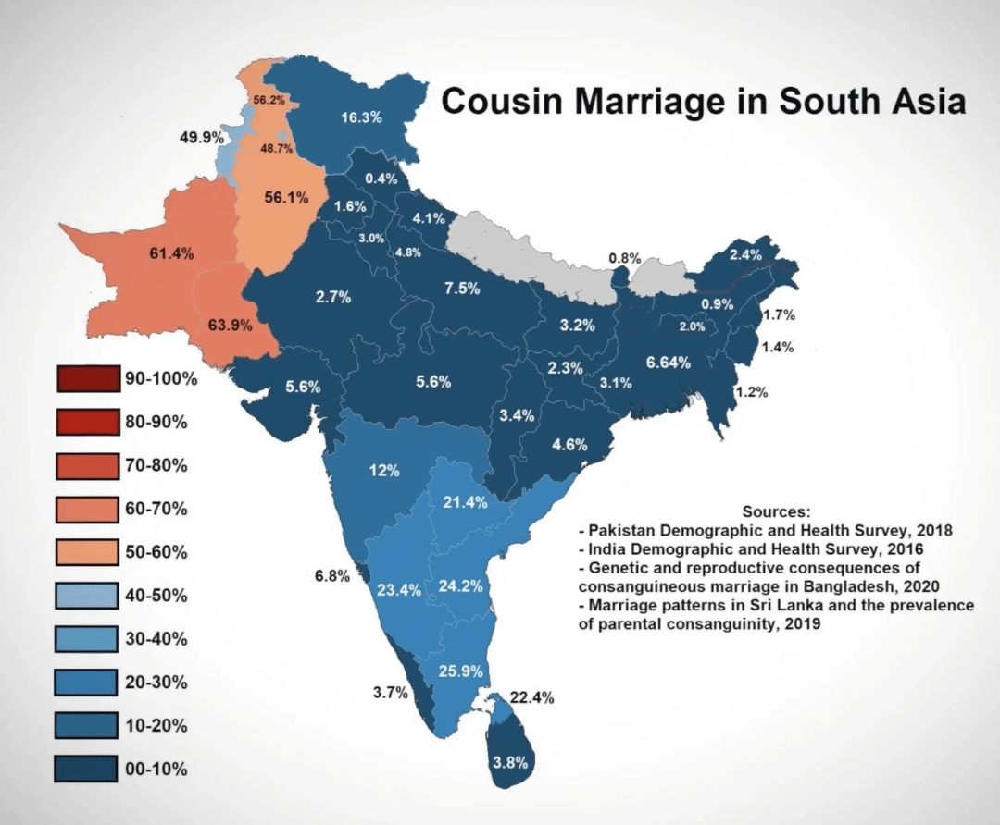
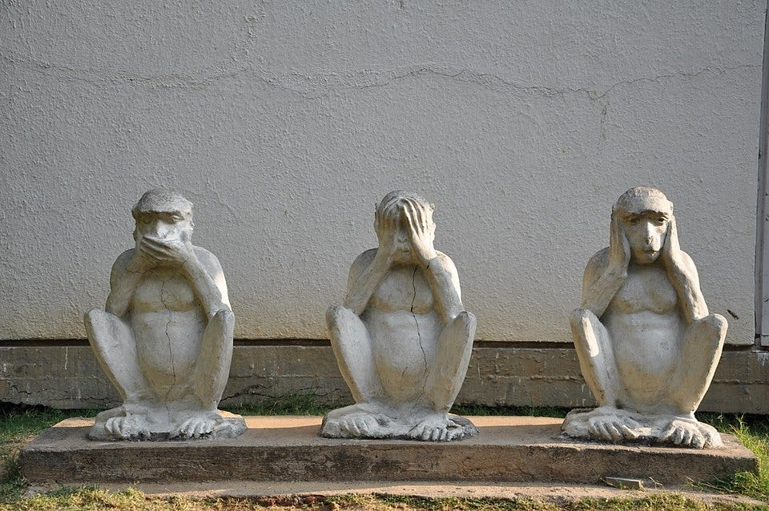
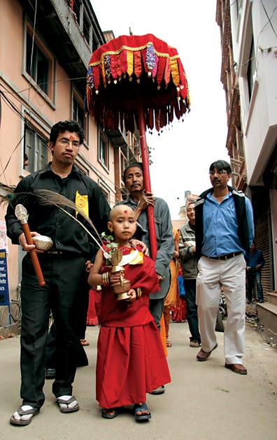

+++
title= "Was the Buddha Scythian ?"
subtitle= "Of course not. He was actually Chinese."
author= ["Sugam Pokharel"]
date= "2026-03-17"
toc = true
+++

# Was the Buddha Scythian ?

> Of course not. He was actually Chinese.


## Introduction



Fig: Bodhnath Stupa in Kathmandu, Nepal.

This is Bodhnath Stupa in central Kathmandu, Nepal. It is a beautiful structure and quite old; it is from the 500s CE at the latest. The eyes at the top remind me of an old Nepali song that goes “Where there are Buddha’s eyes …”. Anyway, there are two aspects of Stupas like these, along with other things of course, that have led many to wonder the same thing - Was Buddha a Scythian ?

Stupas like the one pictured above litter the Buddhist world. “_stūpa_” in Sanskrit means something like mound or heap. One would not get a better translation of _kurgan_, for which the Scythians are famous for, into Sanskrit than that. Stupas also contain, at least theoretically, the remains of the Buddha himself. So, they are actually burial mounds and not just resemble them. Early Indo-Aryans did practice burial but by late Vedic times (~500BCE), when the Buddha is supposed to have lived, burial mounds (using the exact word ‘_stūpa’_) are routinely condemned by Brahmin authors as demonic.

The eyes at the top of stupa are also blue. Why would the Buddha, born in eastern part of South Asia, be depicted with blue eyes? The answer is immediately suggested by his epithet. Buddha is often called ‘Śākyamuni’ or ‘Śākya sage’. The word used here ‘Śākya’ sounds eerily similar to another Sanskrit word ‘Śaka’ meaning ‘Scythian’. Indeed, ‘Śākya’ is a perfectly grammatical derivative of ‘Śaka’ meaning ‘relating to Scythian’. So, was the Buddha Scythian ?

Of those who are interested if the Buddha was actually Scythian, we can divide them into two broad camps. The first is of people who genuinely wonder if the Buddha was actually Scythian due to the reasons listed above as well as others that we will discuss further. For these I’ll discuss both the reasons due to which one might potentially be inclined to believe that the Buddha may had been a Scythian or at least have some connection to them. The second camp is of those people who, for whatever reasons, do not like present day Indians but like Buddhism and thus do not believe, or perhaps do not want to believe, that Buddhism may actually have much to do with Indians not only geographically but also ethnically. For these I’ll say nothing, both because nothing I say will change their minds but also because I have no interest in becoming anti-racism crusader and to tell people whom to like or dislike. Instead I’ll try to do a brief history of Scythian Buddha and similar ideas to show they have been applied not only to Buddhism but parts of Greek and Roman histories as well.



Fig: Scythian Buddha meditating in the open steppe.

### “Historical Buddha”

Before dealing with whether or not the Buddha might have been Scythian, let us first discuss what scholars generally agree about the historical context of the Buddha. We have no written source contemporary with the Buddha as there was no writing at all in South Asia in the time period that he is supposed to have lived. Early Buddhist texts place him around the eastern part of South Asia in what are today Indian states of Uttar Pradesh, Bengal and Bihar as well as parts of western Bangladesh and southern Nepal. As for the date, different Buddhist traditions differ among themselves though they agree that he died at the age of 80. Sri Lankan Theravada tradition, for example, considered him to have lived from ~624 - 544 BC. Another tradition has his life as 563-483 BC. Scholars nowadays consider the date of the ‘historical’ Buddha around 460 - 380 BC, or at least the fifth Century BC more generally.


In any case, the ‘historical’ Buddha is supposed to have lived in Eastern India around the mid first millennium BCE. He was from a royal, or at least an aristocratic, family of the Śākya-s. All early Buddhist writings are in middle Indo-Aryan languages. The languages spoken in the same area today are also belong to Indo-Aryan languages. So, it is likely that he would belong to, or at least have considered himself, Indo-Aryan ethnically.

I’ll discuss the likelihood of the Buddha being Scythian in two parts. The first will discuss all potential arguments that I have encountered and in the second I’ll argue how these arguments are not very convincing. I said it. It is very unlikely the Buddha was, or was supposed to be, Scythian.

## Possible Arguments

### 1\. The words Śākya and Śaka

Starting from the late first century BCE, Scythian tribes started to slowly push on their neighboring states to form kingdoms in the northwest of the Indian subcontinent. The states they defeated were Indo-Greek, Indo-Parthian and native kingdoms whose glory days were long past. There were two major kingdoms of the Scythians in India - one in the north around Punjab called the Northern Satraps and one in Gujrat called Western Satraps. The kingdom of the Western Satraps was, as far as I know, the last major power associated with the Scythians anywhere in the world. They remained in power up to the 390s when they were conquered by the Guptas at last, though by this time they had long being assimilated and were hardly Scythian in anything but paternal descent.

These Scythians, when using Sanskrit, referred to themselves as well as their neighbors referred to them as ‘_Śaka_’. As I said earlier, this sounds awfully close to ‘_Śākya_’, Buddha’s family name. In English, there are various ways a noun may be converted to a corresponding adjective. From the toponym _Rome_, we can have, for example, _Roman_. This word _Roman_ may mean the people, language, architecture or anything. In Sanskrit, there are various ways to do this too. One is such that the vowel is changed to its vowel gradation superior and some change may or may not take place in the latter sounds. Take the word _Buddha_ from the root bodh- meaning something like the ‘awakened one’. From this word, we get _Bauddha_ \- ‘relating to the Buddha’ which means Buddhists. If we do the same for Śaka (Scythian) we get _Śākya_ which is, quite conveniently the name of the Buddha’s family.

Now, the Buddha’s family is called _Śākya_ in Sanskrit but Early Buddhist texts are usually in Pali or other Middle Indic languages. In these languages, the names for Buddha’s family are sakya in Pali, and Sakya or Sākya in some other Middle Indic languages and sound even closer to the Scythian one.

### 2\. Burial Customs and _stūpa_

If you know anything about the steppe, you probably know about the _kurgans_. These are massive burial mounds that dot the landscape of western steppe. Due to climate, these burials often become filled with ice and are often preserved (if grave diggers have not plundered them already) in very pristine conditions. Most of the best preserved Scythian artefacts as well as bodily remains that survive are from kurgans that modern scholars and archaeologists have opened and studied in modern times.

These kurgans are not unique to the Scythians only. Inhabitants of the Eurasian steppe created similar burial mounds from the fifth millennium BCE onwards. The prevailing theory that traces the origin of Indo-Europeans to the Pontic Steppe is called the ‘Kurgan hypothesis’ for a reason afterall. Still, Scythian kurgans are often more numerous than those attributed to other groups and they are number among them some of the larger ones. Some of these, like the Salbyk kurgan or the Arzhan kurgan, are absolutely massive structures. The origins of Russian academic study of the Scythians was also intially propelled by the interest aroused by these kurgans if I remember correctly. So, it is with the Scythians that the kurgans are mostly closely connected to.

The Scythians were mostly East Iranic speakers and thus formed a cousin branch to the Indo-Aryans. We don’t have much knowledge of what their language(s) were like but Avestan, in which the scriptures of the Zoroastrians are composed in and is an Eastern Iranic language too and has a fair amount of surviving textual corpus, must have been somewhat mutually intelligible with Old Indic (Vedic Sanskrit) even as late as ~1000 BC. This is from my own knowledge of these languages and not an academic opinion of a historical linguist, so I don’t know how accurate it is but these two languages feel to me as mutually intelligible as say Spanish and Portuguese are today. Spanish and Portuguese split from their common ancestor some 800-900 years ago which is roughly the same timeframe that I think Old Indic and Old Iranian separated. [^1]



Fig: The Great Stupa at Sanchi. The original structure is from 3rd century BCE.

Early Indo-Aryans probably must have related burial customs and could probably have round burials. It is not impossible but I’m not sure there are any archaeological remains to say it either way. As time goes on burial becomes less and less frequent while burning the bodies in funeral pyres becomes more common. For the burials that did occur, square mounds seem to have been preferred while round mounds were thought to be fit for demons. Śatapatha-brāhmaṇa was compiled in Eastern India in much the same places where the Buddha is suppossed to have lived around 700-600 BCE. On burials, it has the following:

> catuḥsrakti devāś cā’surāś co’bhaye prājāpatyā dikṣv aspardhanta te  
> devā asurānt sapatnān bhrātṛvyān digbhyo'nudanta te'dikkāḥ parābhavaṃs tasmād yā daivyaḥ prajāś catuḥsraktīni tāḥ śmaśānāni kurvate'tha yā āsuryaḥ prācyās tv adye tvatparimaṇḍalāni te'nudanta hy enān digbhya ubhe diśāvantareṇa vidadhāti prācīṃ ca dakṣiṇāṃ cai’tasyāṃ ha diśi pitṛlokasya dvāraṃ dvāra ivai’nam pitṛlokam prapādayati sraktibhir dikṣu pratitiṣṭhatī’tareṇā’tmanā’vantaradikṣu tad enaṃ sarvāsu dikṣu  
> pratiṣṭhāpayati
> 
> Śatapatha-brāhmaṇa 13.8.1.5
> 
> 5\. Four-cornered (is the sepulchral mound). Now the gods and the Asuras, both of them sprung from Prajapati, were contending in the (four) regions (quarters). The gods drove out the Asuras, their rivals and enemies, from the regions, and, being regionless, they were overcome. Wherefore the people who are godly make their burial-places four-cornered, **whilst those who are of the Asura nature, the Easterns and others, (make them) round**, for they (the gods) drove them out from the regions. He arranges it so as to lie between the two regions, the eastern and the southern, for in that region assuredly is the door to the world of the Fathers: through the above he thus causes him to enter the world of the Fathers; and by means of the (four) corners he (the deceased) establishes himself in the regions, and by means of the other body (of the tomb) in the intermediate regions: he thus establishes him in all the regions.
> 
> Translation by Julius Eggeling (1882). Emphasis mine.

Around mid first millennium BCE, Indo-Aryan expansion into eastern India was probably still not very strong and people still remembered migrating thither. Even long afterwards, more eastern parts were considered impure lands and Brahmins who had travelled there had to undergo purification ritual after returning to their own lands.

Isn’t it interesting then that it is here that we find in Early Buddhist texts the _Śākya-s_ who have a name similar to the Scythians and erect round stupas. These stupas all contain, or perhaps “contain”, relic of the Buddha himself. They do look quite different from the earthen mounds of the steppe but it seems not impossible, at the first glance at least, that they may be evolution of the same basic concept.

Though many scholars have noticed this, the following passage by Jean Przyluski makes the arguments clear: [^2]

> From the north of the Black Sea to the Caspian stretches a country of steppes, which extends into Asia as far as the Altai. On these immense spaces several pastoral races have lived who have played a prominent part in the history of Asia in general, and more particularly, of India: Turks, Mongols, Scythians, Aryans, Ougrians, etc.... The best known at the prehistorical period are the Scythians. Let us examine briefly the tombs which have been discovered in the northern part of Caucasus and of the Black Sea.
> 
> The mounds found in the Kuban (North-East of the Caucasus), belong to two different types: common or princely; the social rank of the dead ruled the dimension of his tomb.
> 
> In the big kurgan of Maikop, the tomb was divided into three rooms and it is supposed to have sheltered a high personage and his wives. North of l’ont, the tombs are always covered by a tumulus and these kurgans have a circular basis. Their size is not always the same: generally they do not exceed 3m. in height, and 30 to 50m, in diameter. Some of the mounds, however, are 15m. high with a diameter of 80m. Sometimes the kurgan covers several tombs instead of one.
> 
> It appears then that the kurgans are just as diverse in kind as the Buddhist stūpas. The latter are either individual or collective tombs, the tombs of kings, of Buddhas, or of disciples. When the Buddhist stūpa is compared to the zikkurat or to Mount Meru, the more developed type only thought of. But the actual one is infinitely more complex.
> 
> Besides, the big stūpas do not appear before the second century B.C. Their construction in India seems to have coincided with the invasions. This fact raises the question whether some pastoral tribes-constructors of kurgans may not have played a part in the creation of the Buddhist stupa. We hear it often said that the latter has a hemi-spherical roof. But the dome of the big Sanchi stūpa is not in reality an exact hemisphere: its diameter at the base is decidedly more than double its height, as observed on the pastoral kurgans.
> 
> True enough, the first Scythian invasions seem posterior to the first big stūpas. And although it is impossible to give with any certitude a date to the Barhut stūpa, it was probably built prior to the establish-ment of the Saka dynasties in India. But we must not forget that there was the influence of the barbarians on Buddhist art before the Indian soil was actually conquered by them.
> 
> The contact between India, the West and the North was first achieved in the Greek kingdoms. Greek kings like Menander have rendered a great help to the creation of a mixed society, composed of Greek elements, Scythians, Hindus etc., where Buddhism found a ready soil for its development. Greco-Buddhist sculpture was born through this intermixture of races, and at the same time the type of the big stupa was being elaborated. A certain amount of truth lies probably at the bottom of the tradition which relates the erection of memorials on the ashes of Menander. The sculptures, on the railing of the Barhut stūpa bear Kharosthi characters, which proves the collaboration of artists from the North-West.

Przyluski is not, I should emphasize, arguing that the Buddha was Scythian but only that there may have been Scythian influences in the evolution of the stūpa architecture. The arguments for this specific part, however, are nonetheless the same.

### 3\. Incestual Origin Myths

_Ambaṭṭhasutta_ occurs early in the _Dīgha Nikāya_ (Long Discourses) of the Buddha. Ambaṭṭha is a young Brahmin student who is sent by his teacher to find out what sort of person this Gotama fellow is. Ambaṭṭha behaves with extreme rudeness towards the Buddha. [^3]

> So he approached the Buddha’s dwelling, cleared his throat and knocked on the door-panel, and the Buddha opened the door. Ambaṭṭha and the young students entered the dwelling. The young students exchanged greetings with the Buddha, and when the greetings and polite conversation were over, sat down to one side. But while the Buddha was sitting, Ambaṭṭha spoke some polite words or other while walking around or standing.
> 
> So the Buddha said to him, “Ambaṭṭha, is this how you hold a discussion with elderly and senior brahmins, the tutors of tutors: walking around or standing while I’m sitting, speaking some polite words or other?”
> 
> “No, worthy Gotama. For it is proper for one brahmin to converse with another while both are walking, standing, sitting, or lying down. But as to these shavelings, fake ascetics, primitives, black spawn from the feet of our kinsman, I converse with them as I do with the worthy Gotama.”

The text shows Ambaṭṭha behave with extreme rudeness as he considers a Brahmin himself beyond all other mere mortals ‘ black spawns’. Buddha replies with an etiological myth not only about how Kshatriyas are superior to Brahmins and even in case they weren’t Ambaṭṭha’s own lineage originated with the king of the _Śākyas_ getting his ‘black’ slave pregnant. It is in this context that the origin of the _Śākyas_ is touched upon.

> So the Buddha said to him, “What is your clan, Ambaṭṭha?”
> 
> “I am a Kaṇhāyana, worthy Gotama.”
> 
> “But, recollecting the ancient name and clan of your mother and father, the Sakyans were the children of the masters, while you’re descended from the son of a slavegirl of the Sakyans.But the Sakyans regard King Okkāka as their grandfather.
> 
> Once upon a time, King Okkāka, wishing to divert the royal succession to the son of his most beloved queen, banished the elder princes from the realm—Okkāmukha, Karakaṇḍa, Hatthinika, and Sinisūra. They made their home beside a lotus pond on the slopes of the Himalayas, where there was a large grove of _sakhua_ trees.
> 
> For fear of breaking their line of birth, they slept with their own (_saka_) sisters.

That the Okkāka princes would rather sleep with their own sisters rather than dilute their bloodline is presented here as a proof of their line’s superiority over the Brahmins’ claims. The complete story referenced here is told in Buddhaghosa’s (5th century CE, Sri Lanka) commentary on this passage. I’ve seen it referenced many times in literature but couldn’t find any translation of the passage. So, what follows is my own translation. As my knowledge of Pāli is not great, there are probably grammatical errors as well mistakes in interpretation but the general sense should be, I think, clear.[^4]

> “He exiled them” means he sent them out. Now, indicating the name ‘Okkāmukha’, he spoke the beginning. Here is the history (so referred to). Mahāsammata, the first king of the eon, had a son named Roja. Roja’s son was Vara-roja. Vara-roja’s son was Kalyāṇa. Kalyāṇa’s son was Vara-kalyāṇa. Vara-kalyāṇa’s son was Mandhātā. Mandhātā’s son was Vara-mandhātā. Vara-mandhātā’s son was Uposatha. Uposatha’s son was Cara. Cara’s son was Upa-cara. Upacara’s son was Makkhādeva. In Makkhādeva’s line there were eighty four thousand Kshatriyas. After that there were three Okkāka dynasties.
> 
> Among them, the third Okkāka had five queens: Bhattā, Cittā, Jantu, Jālinī and Visākhā. Each of them had a retinue of five hundred women. The eldest of the queens had five sons: Okkāmukha, Karakaṇḍu, Hatthinika, and Sinisūra and five daughters: Piyā, Suppiyā, Ānandā, Vijātā, and Vijitasenā. After giving birth to these nine children, she died. Now the King selected another young and beautiful queen and established her as his chief queen. She gave birth to a son named Jantu. After giving birth to him, she adorned him well on the fifth day and showed him to the king. The King became happy and gave her a boon. She discussed with her relatives and then asked for her son to be the king. The King said, “Not so, wretched woman. You want to harm my other sons”. But the queen pleased him again and again in private and said, “King! saying untrue words doesn’t suit.”, and kept on asking him (for her son to be the king).
> 
> The King called his sons and said, “Dear boys, I saw your youngest brother Jantu and immediately gave a boon to his mother. She now wants the kingdom for her son. You all can take as many elephants, horses and chariots except the royal ones and go now. After I die, you may come back and rule.” So he sent them out with eight ministers.
> 
> They cried in various ways and said, “Father, forgive us for our faults!” Then the royal ladies (thought), “We should go with our brothers too.” So, after asking the king for permission, the sisters also took (the things they needed) and set out. They departed from the city surrounded with a fourfold army.
> 
> “These princes will return after their father’s death. Let us go and serve them”. Thinking like this, many people went out and followed (the princes). On the first day, the army became one yojana long; on the second day, two yojanas; and on the third day, three yojanas. The princes consulted, “This hoarde is very large. Even if we defeat some neighboring ruler and take over, it wouldn’t be enough for all of us. Even then, what is the use of oppressing others ? Jambudīpa is larger, we can establish a city in the forests.” So they went to the Himalayas to establish a city there.
> 
> …
> 
> Then, having seen those princes who had come to his dwelling place while searching for a site for a city, and having questioned them and learned their story, \[Kapila\] spoke, feeling compassion for them: ‘A city built on this spot of my leaf-hut will be the foremost city in Jambudīpa . Among the men born here, every single one will be able to overcome a hundred men or even a thousand men. Build the city here; make the king’s palace on the spot of the leaf-hut. For standing in this place, even the son of an outcaste would surpass a Wheel-Turning Monarch in power.’ ‘But Venerable Sir, is this not your dwelling place?’ \[they asked\]. ‘Do not worry about my dwelling place,’ \[he said\]. ‘Having made a leaf-hut for me on one side and built the city, give it the name “Kapila-vatthu” .’ They, having done so, made their residence there.
> 
> Then the ministers thought: ‘These boys have reached of age. If their father were near, he would arrange their marriages. But now it is our responsibility.’ They consulted with the princes: ‘O Princes, we do not see any warrior-princesses who are our equals, nor any warrior-princes equal to our sisters. By union with those who are not our equals, our children—born either on the mother’s side or the father’s side—would be impure and fall into a mixing of the castes. Therefore, let us live together with our own sisters.’ They, out of fear of mixing the castes, established the eldest sister in the position of a mother and lived together with the remaining sisters.

Okkāka-s then were quite fond of incest for preserving the ‘purity’ of their blood. From what we know of law books as well as the general social picture, this was _not_ (and _is not_) considered normal. Not only were cousin marriage not allowed but anyone who shared ancestry on seven generations on the paternal side and five on the maternal side. Anything closer than that was considered incest.

Although quite later than the time of the Buddha, this verse from the _Mānavadharmaśāstra_ is the classic description of this concept:[^5]

> ```
> asapiṇḍā ca yā māturasagotrā ca yā pituḥ 
> sā praśastā dvijātīnāṃ dārakarmaṇi maithune 
> Mānavadharmaśāstra 3.05
> ```
> 
> A girl who belongs to an ancestry (5.60 n.) different from his mother’s and to a lineage different from his father’s, and who is unrelated to him by marriage, is recommended for marriage by a twice-born man.
> 
> Translation by Patrick Olivelle

So, such blatantly incestuous relations were not supported in Buddha’s contemporary society. Do we know of any people that may be connected with early Buddhism among whom such practices were common ?

We do. Zoroastrians. While we don’t know much about what the Scythians themselves thought, Zoroastrianism first arose in Northeast Iran and western Afghanistan among people who were, like the Scythians themselves, East Iranian speakers. Although it may be naïve to believe that the beliefs and customs of these people and the Scythians (themselves quite a disparate collection of related people groups) to be exactly the same or to believe conversely that the Scythians were themselves Zoroastrians, it is certainly probable that they did share common customs. Incest was, to put it mildy, quite celebrated among the Zoroastrians. I don’t even want to spend much time even thinking of such things to search in the original literature but here is what [Encyclopedia Iranica](https://www.iranicaonline.org/articles/marriage-next-of-kin/) says on the subject:

> In Zoroastrian Middle Persian (Pahlavi) texts, the term _xwēdōdah_ (Av. _xᵛaētuuadaθa_) is said to refer to marital unions of father and daughter, mother and son, or brother and sister (next-of-kin or close-kin marriage, nuclear family incest), and to be one of the most pious actions possible. The models for these unions were found in the Zoroastrian cosmogony. The meaning and function of the Avestan term is not clear from the contexts.
> 
> To what extent _xwēdōdah_ was practiced in Sasanian Iran and before, especially outside the royal and noble families (“dynastic incest”) and, perhaps, the clergy, and whether practices ascribed to them can be assumed to be characteristic of the general population is not clear (see, e.g., Mitterauer, pp. 235-36). Evidence from [Dura Europos](https://www.iranicaonline.org/articles/dura-europos), however, combined with that of the Jewish and Christian sources citing actual cases under the Sasanians, strengthen the evidence of the Zoroastrian texts. In the post-Sasanian Zoroastrian literature, _xwēdōdah_ is said to refer to marriages between cousins, which have always been relatively common (see Polak, I, pp. 200-1; Darmesteter, 1891, p. 367; Givens and Hirschman; Herrenschmidt, 1994; Bittles et al., p. 75).

Modern reforms of Parsi communities during the colonial period has led to much that is disagreeable but the reduction in such heinous custom is one of its best outcomes.[^6]

Anyway, if the _Śākyas_ really were Scythians, as the proponents of this theory argue, it would make sense that they would retain their incestuous ways even as they migrated and assimilated to lands where such practices were viewed negatively.

### 4\. Mind, Body and Speech

A striking parallel between the Śākyas and Iranian nomads like the Scythians are said to emerge in core Buddhist ethical teachings, which echo Zoroastrianism’s triad of “good thoughts, good words, good deeds” (humata, hukhta, hvarshta). In the Pāli Canon, the Noble Eightfold Path emphasizes right view and intention for the mind; right speech and action for words and deeds; while right livelihood bridges ethical conduct holistically—but at its heart lies a distilled focus on purity across mind, body, and speech. This framework, repeatedly invoked as “guarding the three gates” against defilement, feels distinctly non-Vedic, prioritizing personal moral agency over ritual sacrifice and purity laws. There are Brahmanical parallels but these seem to be later and influenced in turn by Buddhism rather than other way around.

Early Buddhist formulations map almost one-to-one onto Zoroastrian ethics, judging thoughts (mana), words (vāč), and actions (xratau) at the Chinvat Bridge. The Buddha’s discourses in the _Dīgha Nikāya_ and _Abhidhamma_ analysis reinforce this, alien to mainstream Vedic thought. Herodotus notes Scythians swearing oaths on bow, arrow, axe, and cup—symbols of strategy (thought), oath (word), and strike (deed)—mirroring the triad.

The Buddha’s rejection of caste and Vedic dominance aligns with Zoroaster’s reforms against priests, suggesting Śākyas retained an Iranian substrate absent in neighbors like Licchavis or Vajjis. This is not exact as Zoroaster himself seems to have lived in the same sort of Indo-Iranian priestly context as the Vedic seers themselves. Still, Zoroaster’s emphasis on strict dualism and more moral questions are not central to earlier Vedic tradition even though there are many parallels still.

### 5\. Early Iron Age Scythians



Fig: Furthest reach of Indo-Scythian power in South Asia.

You might be wondering how the Buddha can be Scythian when even the latest date of the Buddha’s supposed life puts him centuries before even the traces of early Scythian rule in India. Even the latest date for the Buddha doesn’t go beyond ~350 BC whereas the earliest Scythian King who established a strong presence in India was Maues (r. 98-60 BCE).

Usually the people who think that Buddha could have been Scythian keep it a bit vague how exactly the Scythians are supposed to have ended up in Eastern India centuries before their historical presence even in Western India and without any textual source noticing this. But there is one scholar who has actually described how this could have happened.

Michael Witzel is one of the leading scholars of Vedic literature. There are probably just a handful of people in the world who can match his expertise and breadth of knowledge in the field.

Unlike most of the “I’m just saying” type suggestions for the possibilities for a Scythian Buddha, Witzel places Scythians migration in actual historical context. There are, however, no sources I could find where he discusses this in detail. Jayarava Attwood’s paper on the possible [Iranian origins of the](https://www.academia.edu/25950011/Possible_Iranian_Origins_for_the_%C5%9A%C4%81kyas_and_Aspects_of_Buddhism) _Śākyas_ says “_To date, however, he has not given this idea a full treatment which would allow us to really assess its merits._” Attwood’s paper is from 2012 but I have not found any subsequent treatments either. So, all I have to go on is his stray remarks on the possibility of Scythian origins for the _Śākyas_ in the larger context of his larger historical project of locating various Vedic tribes in specific time and place. Witzel is perhaps the leading expert in this specific area of situating Vedic tribes, texts and practices in concrete time and place[^7]. I agree with more or less all of his ideas on placing the specific tribes or their migration etc as also with the larger historical picture he paints but there are often statements that seem to have been based on rather slender evidence.

Attwood also links to forum where Witzel seems to have expanded a bit on this but the forum seems defunct now and though I can see the message listing page on the Internet Archive, it wouldn’t let me see the message itself. So, I don’t know exactly what the arguments are. It is possible then that there were some more persuasive arguments there. As it stands, we’ll go on what we have:[^8]

> Many of these tribes, including the Sakya to whom the Buddha belonged, are called asurya in SB. For it is the Sakya and their neighbors, the Malla, Vajji, etc. who are reported in the Pali texts as builders of high grave mounds, such as the one built for the Buddha. According to SB 12.8.1.5 the “easterners and others(!)” are reported to have round “demonic” graves, some of which may have been excavated at Lauriya in E. Nepal. These graves are similar to the kurgan type grave mounds of S. Russia and Central Asia. However, the origin of the Sakya is not as clear as that of the Malla and Vṛji. They may very well have been (northern) Iranian, and would then constitute an earlier, apparently the first wave of the later Saka invasions from Central Asia.

The reference to SB 12.8.1.5 is the same that we quoted above on the section about burial mounds. Witzel regards Malla and Vṛji, which are located together with the Śākyas in the east as recent migrants from the west as tribes with similar names are mentioned by Panini (4th BCE) as well as Alexander historians as located along the Indus basin.

The argument is not pursued further here and the idea that the Śākyas could be descended from Iron Age Scythians is mentioned as only a possibility.

Attwood, in the paper referenced above, has helpfully summarized Witzel’s arguments. He explains how a group of Scythian (Śaka) nomads could plausibly have migrated into northern India around 850–800 BCE, providing a concrete timeline for the Śākyas’ arrival in the eastern Gangetic region centuries before the Buddha and notes that Vedic texts associated with the eastern Ganges plain omit tribes like the Śākya, Malla, Vajji, Licchavi, and others prominent in Pāli texts, while Pāṇini and Alexander’s historians place the Mallas and Vṛjis in Punjab and Rajasthan. This absence suggests these groups, including the Śākyas, arrived post-late Vedic (ca. 1000–500 BCE) and migrated eastward..

Attwood also narrows Witzel’s somewhat timeframe using Asko Parpola’s hypothesis of “Pāṇḍus” (pale Iranians) entering via the Indus around 800 BCE, with some becoming the Śākyas due to their name’s link to Śaka. Crucially, climate data supports this: an abrupt shift around 850 BCE when increased humidity in from declining solar activity spurred Scythian expansion westward, while weakened Indian monsoons caused aridity which in turn forced further pastoral shifts and migrations. Although Scythian like cultures existed earlier, it is only around the beginning of the first millennium BCE that they expanded all around, coming into contact not only with the Greeks but also with powers in the middle east. Herodotus has several tales about Scythians and related peoples like Cimmerians and Masagatae ostensibly during this period. This aligns with iron-age transitions, Chalcolithic collapses (e.g., Malwa culture), and steppe nomad pressures, allowing Śākyas to reach Bihar, assimilating locally while retaining Iranian traits like kurgan-like mounds or Zoroastrian-inspired ethics. This would also explain the absence of these tribes in Vedic texts. They are absent from early texts because they migrated late and are in turn absent from later texts because they migrated far to the east whereas much of middle Vedic texts are localized in the west (Kuru-Panchala region).

## Problems with the Arguments

### 0\. Buddha is a mythical character

I don’t like to be a killjoy and call people’s religious beliefs into question or to get into unnecessary theological wars that benefit no one but come on. The Buddha is a mythical character. It should be obvious that he is. He is in the same category as Moses, Arthur or Santa Claus[^9]. He is born out of the side of his mother, walks seven steps just after being born as the heavens rebound with joy, talks with gods, performs miracles left and right. The only reason the idea of ‘historical Buddha’ is taken seriously at all is that academic study of Buddhism currently acts more like apologetics for Western ‘spiritual but not religious’ Buddhists whose version of the Buddha is a hyper scientific philosopher that no actual Buddhist tradition ever believed in. In actual practice, the ‘historical’ Buddha is whatever remains after all the ‘supernatural’ is taken out of supposedly ‘early’ Buddhist Texts. I’m also the strongest man in the world if you don’t count everyone who is stronger than me. After stripping everything the modern ‘scholar’ finds problematic what remains is the ‘historical’ Buddha - rational, clean shaven, who has no special teachings that go against universal morals of ‘progressive’ westerners except pathetic ‘just be good man’ and stupid motivational quotes to spread on Facebook. Indian brother of the Hippie Jesus, if I may say so.

We have no historical evidence of the existence of the supposed ‘historical’ Buddha. The earliest dated evidence comes from around ~250BC from an inscription in Lumbini commissioned by the Mauryan Emperor Aśoka who says that he has waived the taxes in that village because it was the birthplace of the Buddha. This is, at the latest, some 130 years after the death of the Buddha. Many Buddhist lineages in the pre-modern world disagreed about when the Buddha lived and some considered him living as early as 9th century BC. Even the very early Buddhist texts do not reach Buddha’s own lifetime (being late 4th century BC to 3rd Century BC) and most are much latter.

Even if the details reported of the Buddha’s life were all ordinary in nature and didn’t include any supernatural events, these are extraordinarily thin pieces of evidence to go on. In fact, [Steven Lindquist](https://www.degruyterbrill.com/document/doi/10.1515/9781438495644/) has claimed the same for Yājñavalkya who is supposed to have lived sometime before the Buddha in the same general vicinity. Early depictions of Yājñavalkya are mostly consistent and he performs mostly non-supernatural actions. Still, Lindquist argues we should rather study Yājñavalkya the character rather than some unattainable historical figure. The text that we have are not histories or chronicles but literary text with different aims. We have no contemporary record for the Buddha. We don’t even have a good idea of general history of the area around the time. All the supposed dynastic and social histories of India during the mid first millennium BCE are built out of incidental mentions in Buddhist and Jain canons with what little archaeology exist mainly being shoehorned in to fit preconceived narratives. So, when you say Buddha died in such and such kingdom under the reign of such and such king, so we know the historical context in which he lived, just remember that the ‘historical context’ is itself constructed out of Buddhist (and some Jain texts) that are neither historical in nature nor pretend to be so but are religious and hagiographical.

I am neither surprised nor concerned with the idea that committed doctrinal Buddhists would advance the idea of Buddha as a historical person. I have nothing against them at all. But I am quite annoyed when supposedly impartial academics espouse dogma as scholarship. If you are interested in the idea of the ‘historical’ Buddha and how it was constructed mostly (though with important exceptions) by Western academics, read Bernard Faure’s _[The Thousand and One Lives of the Buddha](https://doi.org/10.2307/j.ctv2524xn9)_. Some years before this, David Drewes had published _[The Idea of the Historical Buddha](https://www.academia.edu/36121418/The_Idea_of_the_Historical_Buddha_JIABS_2017_)_ in _Journal of the International Association of Buddhist Studies_ (2017). A number of leading Buddhist ‘scholars’ published their rebuttals to Drewes that read less like scholarly argumentation and more like screeds full of name-calling and ad-hominems. Read the full series of exchange. Many of these papers are available online openly. Really, just go to David Drewes’ Academia.edu page and read the comments on his post. Supposedly serious academics and scholars of Buddhism acting like tantrum throwing children when just confronted with the idea that we have no historical evidence for the supposed Buddha. It has really cemented in my mind what I had suspected for long - the ‘Buddhist Studies’ is more or less a front for ‘Buddhist’ (TM) Apologetics and not scholarship at all.

This perhaps undercuts all by arguments against Buddha being Scythian entirely. Buddha is a mythical character and can be whatever you want him to be - Icelander, Chinese, New Guinean or even Martian. So, he could be Scythian, I guess. But what we are discussing here is not who the ‘historical’ Buddha was but what he was normally thought to be. Harry Potter may not be real but it is generally agreed that the most popular, and canonical if one considers the original books as such, iteration of Harry Potter is supposed to be British.

### 1\. On Śākya and Śaka

Śākya is etymologically derived from the root śak- meaning ‘to be capable’ or ‘to be powerful’. It is clearly the sort of name that people call themselves. In fact many ethnic groups around the world are named something like ‘good people’ or ‘real people’ or ‘free people’ or something like that. Śaka is loaned from some Iranian language where it was probably saka (as it is in Old Persian). What it means is unclear. It could be from a cognate root and mean the same thing as Śākya or it could mean ‘nomads’ or something else.

If both these names are indeed derived from Indo-Iranian ćak- root, it is clear why two people groups might share the same name. Even if they do not derive from the same root, it is possible that different people groups or places share the same name. There are, for example multiple Albania-s, Iberia-s, Georgia-s and so on. British Isles were often called Albion in medieval times. I can assure you they weren’t settled by the Albanians nor did Georgians, from country in the Caucasus, colonize Georgia the state in US. Of course, such shared names are not exactly common and people do notice them but they aren’t exactly unheard of either.

In my personal opinion, we should be careful about accepting such coincidences as proof unless there are other strong supporting arguments available. If it were that Buddha was supposed to have been born in 2nd Century BC Afghanistan, the coincidence in names would be suggestive even if the traditional accounts were the same as they are now. As it stands, it is difficult to take the similarity between the names as anything more than coincidence, especially as the names just sound vaguely similar and are not even the same as in other coincidental duplicates.

### 2\. On Burial Customs and _stūpa_

I’m not trying to be facetious but the argument about the similarities between kurgans and Buddhist stupas does not strike as particularly true to me. Its like those conspiracy memes about pyramids around the world that somehow lead into aliens and energy sources and whatnot. There are pyramids all over the world because it is one of the easiest and most reliable way to build large structure that are strong and don’t collapse under their own weight. Even then Mesoamerican pyramids are quite different in building material, purpose as well as their overall look from Egyptian pyramids and the same holds from pyramidal structure in other ancient cultures.

Similarly, there are more differences than similarities between kurgans and stupas if you think more than a second: Kurgans are burial mounds of normal, though upper class, people. They contained actual dead bodies. Buddhist Stupas are just for a certain part of the Buddha’s remains. They are generally not at all burial centers of Buddhist laymen or of rulers but of the Buddha and sometimes of monks and nuns. They are built of different materials. As Tolkien replied when pressed about the similarities between the rings from The Lord of the Rings and Wagner’s Ring Operas, both are round and that’s where the similarities end.



Fig: Top- A Stupa at Sanchi. Bottom - A Scythian kurgan

Furthermore, round burial mounds are present in vastly different cultural contexts over millennia. Pre-Columbian native Americans built round burial mounds too which are, both in form and in purpose, closer to Scythian kurgans than the Buddhist stupas are but one would not imagine Scythian presence there. Round burial, as a generic category with variation between them, are not especially rare in history.

Although square burial mounds seem to have been preferred by mid 1st millennium BCE as in the extract we quoted above, there are also texts from Brahmin authors that either prescribe, or at least don’t proscribe, round burials. There was variety of opinion in this regard as in many others. Indo-Aryans must have first migrated from regions where such kurgans were common about a thousand year before the Buddha and if Witzel is to be believed waves of Indo-Aryan tribes from the west arrived in South Asia as late as about five hundred years before the Buddha. Much of what we have preserved as Vedic scriptures and all the religious traditions since was the patrimony of the Kuru tribe which was one of the latest to cross the Hindu Kush and arrive at Punjab. It is far more likely that earlier Indo-Aryan tribes who were pushed eastwards by the formation of a massive Kuru super-tribe in the west might have preserved some archaic customs than to posit some nebulous Scythian influence.

Even if we do grant that Stupa architecture as it developed had Scythian influences (which I think is likely as Northwest India was ruled in part by Scythian dynasties at the same time when Greco-Buddhism was flourishing and Buddhism travelled along the silk road to China), it does not follow that the Buddha need be Scythian himself. The presence of Neo-Classical architecture in Britain doesn’t obviously mean that Angles and Saxons were actually Greek tribes. Architecture, like ideas or even languages, can spread and be normalized among a people without any noticeable change of people themselves.



Fig: Scythian devotees. From a Buddhist site in Buner, Pakistan.

Furthermore, early Jains too erected stupas sometimes. Jainism arose in the same cultural context as Buddhism. The early history of Jain Stupas, like much of the religion itself, is not exactly clear. So, it is possible that they may have borrowed this practice from the Buddhist but a common origin is at least as likely, which in turn makes the Scythian theory even less likely.

### 3\. On Incestual Origin Myths

As for the presence of incest in Okkāka origin myth, there are two problems with taking them as an indication of presence of actual incest in real life among Buddha’s people and to connect them to the Scythians.

The first is that incest occurs in origin myths in many, many cultures and more or less for the same reasons: there simply aren’t enough people (or divine beings) in the beginning of time to continue the line in non-incestuous ways. In the Hebrew Bible, for example, all of humankind ultimately descend from the first two humans - Adam and Eve. For a third generation to then arise, the children of Adam and Eve must have mixed among themselves. There is no other way for the lineage of humans to continue beyond without incest if we take the text at its word.[^10] In Norse myth, Jord (Earth) is both the daughter and wife of Odin. Incestuous nature of Greek and Roman gods is well known- Hera, for example, is both the sister as well as the chief wife of Zeus.

In all of these cases, the presence of incest in myth does not actually translate to allowance of incest in real life. Some Greek cities allowed cousin marriages but except for the god kings of the Hellenistic Age, relation between siblings were punished and were never normal. Romans didn’t even allow cousin marriages. In fact, except for the later influence of Mesopotamian culture and religions, more or less all Indo-European speaking peoples except the ancient Persians seem to have held close kin relations in disdain. I guess even in the Persians it was due to Elamite influences. Anyway, cousin marriages were exceedingly rare in Europe both in Christian and pre-Christian times[^11].

In India itself, there are incestuous myth. RV 10.10 has a great dialogue where Yama and Yamī, the primordial divine twins, converse as Yamī tries to seduce her brother who refuses her advances. The hymn ends without anything happening but a parallel Iranian myth leads one to believe that he would have finally given up and they become the progenitors of human race. In any case, there are patently incestuous myth presented when we know that in real life, not only were such acts punished but even relations between third cousins considered incest. The presence of incest in myth, in short, has no direct correlation to real life and one should not assume it.

The second is that even if one were to take close kin marriage of the Buddhist myths as historical, one would not need Scythian influences on this. Many Sino-Tibetan ethnic groups practice close-kin marriages even today. Cross cousin marriages are considered a characteristic of Dravidian kinship system. Is is not then more probable that the author of most detailed myth of close kin relations for Buddha’s ancestors lived in Sri Lanka, which had strong influence from various folks speaking Dravidian folk and may reflect better his own time and location rather than that of the Buddha? Even today, after all these millennia, the difference in close kin marriage is noticeable in between Indo-Aryan and Dravidian speaking population (excepting Islam of course which the following map doesn’t). Look at Sri Lanka below. Sinhala people, who speak an Indo-Aryan language and are mostly Buddhist, have much lower rates of cousin marriage than Tamils, who speak a Dravidian language and are mostly Hindu or Muslim. Buddhism doesn’t seem to have increased the presence of close kin marriage among the Sinhala - quite the opposite infact, even when they have been in constant presence of Dravidian speaking people for nearly 2500 years.



In Dravidian kinship system however, only cross-cousin marriages are allowed and parallel cousins are considered as siblings. But even then close kin marriage can be explained by the same basic logic of elites, or an ethnic group in general, trying to preserve their wealth and status from leaving their in group due to out marriages. Ptolemies, for example, are famous for all sort of incestuous marriages which were neither approved of nor common among the Greeks in antiquity. If we were to explain this practice among the Ptolemies in the same way that the proponents of Scythian Buddha theory do among the Śākya-s we would have to assume that the Ptolemies were in origin Egyptian or Persian but as things stand there are no reasons to do so. They obviously adopted the custom from the Egyptians without having anything to do with Egypt ethnically.

It is therefore very unlikely that the presence of incest in Buddhist origin myths would imply either their presence in real life or require the Buddha to be Scythian to explain them even if they were.

### 4\. On Mind, Body and Speech

On the importance of good thoughts, good words and good acts in both Zoroastrian and Buddhist thought, I do think the parallels are interesting but the same hurdle occurs here as in previous cases: why would parallels between Zoroastrianism and Buddhism imply a Scythian Buddha at all. Even if we disregard the possibility of transmission of ideas, there is very little evidence that Scythians were doctrinaire Zoroastrians. For the time period when the Buddha is supposed to have lived, it would be far more economical to assume a Persian Buddha rather than a Scythian one if such parallels are taken seriously. It is true that both Persians and Scythians were Iranian-speaking folks and thus related but they were not exactly the same. By the sixth century BCE, Persians were a sedentary people living in what is now western Iran (Fars-the Persian heartland ever since) that had supported the Elamite civilization from as early as 3000BCE. The Scythian campaigns of Darius the Great shows that even among such related people, sedentary and nomadic lifestyles brings about differences that cannot just be elided willy-nilly. Persians ruled a good part of Indus valley from the late sixth to late fourth centuries BCE. Thus, the upper Indus valley where many important Buddhist sites and communities would form in the immediate centuries afterwards was ruled by the Persian Achaemenid for about 200 years. This is, I would say, a far more reasonable source of influence even if one discounts the possibility of coincidence (which I don’t).



Fig: Gandhi’s three monkeys signifying speak no evil, see no evil and hear no evil.

### 5\. On Early Iron Age Scythians

The idea of Iron Age Scythians migrating into Eastern India is, I think, better than just assuming that the Buddha was Scythian somehow but the arguments for it aren’t particularly strong either. We have already dealt with the incest, the kurgans and the names, so not much remains either way. As for the absence of the absence of such tribes in Vedic texts, the texts that we have are not histories or geographical encyclopedia and it cannot be assumed that they mention all the peoples that existed then. There must have been hundreds of small tribes all over Northern India but it is only a handful of them that the texts mention regularly and a larger number more infrequently. It is entirely possible that the Śākyas were a minor tribe that escaped notice in our remaining sources. Or it could be that the Śākyas were formed out of some earlier tribes that had other names. Both the fusion of multiple tribes to form a new named one or the persistence of one tribal name for a related but different people are not unknown in history. Or, as Bryan Levman argues, Śākyas could be an indigenous tribe that had adopted some Indo-Aryan languages and customs.

As for the Pāṇḍus and their supposed Iranian connection, these are hardly strong arguments. Beyond reflecting the general atmosphere of middle to late Vedic period, it is difficult to take anything in the Mahābhārata as historical. The epic was, furthermore, redacted in even later times and whatever reminiscences of such early times that it had is either well buried in later layers or very murky.

## Nordicism and the Aryan Buddha

[^12]The presence of Indo-Aryan branch has always led to some difficulties for those in the West who have tried to view Indo-Europeans as a racial category. Vedic is one of the earliest attested Indo-European language[^13]. Unlike say Albanian or something, which are spoken by a small number of people, attested late, and are of limited use for reconstructing socioreligious (as opposed to only linguistic) aspect of the Proto Indo-Europeans, Indic is , with other major branches like Hellenic, Iranic and Romance, quite central to the whole project. It was, after all, the recognition of Sanskrit as related to Greek, Latin and Gothic (i.e. Germanic languages) by Sir William Jones at the end of the eighteenth century that Indo-European studies exploded. Along with a small population of Zoroastrian Parsi community, Indic speakers are the only people who profess a religion, however changed or evolved with time, that is patently of Indo-European origin. The wealth of detail about religious rites and social customs for early Indo-Aryan people is quite vast, at least compared to other branches.

All the wealth of material that the Indo-Aryan branch offers for the reconstruction of Indo-European religious, social and linguistic mores are not incidental. Problem arises, however, with the ethnic composition of Indo-Aryan speakers who are, you see, brown skinned; many quite strongly so indeed. To consider Indo-European to be then a racial category of predominantly ‘White’ people would then have to include not a handful but a billion people who are categorically not white.

How would this difficulty be solved? The most easy answer, and one followed by many colonial era scholars, is to consider that early speakers of Indo-Aryan languages must have been fair skinned people who only became very brown due to later admixture with ‘savage’ indigenous people who were black. This way one can both use the early literary remains of the Indo-Aryans as the work of blue blooded Aryan brothers while simultaneously considering their present day descendants to be products of degenerate miscegenation in the tropics that diluted all Aryan spirit away.

Though phrased in a prejudiced manner, the idea itself is not outlandish at all. Early Indo-Aryan texts are full of very negative statements about dark skinned ‘others’ while curiously no contrasting self designation is found, i.e. while the enemies are constantly portrayed as black, they just don’t say ‘we are white’. It is only with the Buddhist canon that we have Brahmins claiming that they are fair skinned while everyone else is black as even the example of Ambaṭṭhasutta quoted for the Buddhist origin myth above shows. This has often been claimed to be the origin of the caste, the Sanskrit word for which is ‘varṇa’ and literally means ‘colour’.

The inference then is that fair skinned folks calling themselves Aryans migrated from the Northwest and then established the caste system with themselves at top and the ‘black’ indigenous people at the bottom. To say such things, even with a hefty dose of racial superiority or inferiority assigned, was not controversial up to the mid 20th century. The following is from the entry on Hinduism from 1911 edition of the Encyclopedia Britannica by Hans Julius Eggeling. Eggeling was, I should note, neither very racist for his time nor was he a fringe scholar. His translation of the _Śatapathabrāhmaṇa_, which we quoted earlier on the topic of burial mounds, is still the standard translation of that work:

> But when the fair-coloured Aryan immigrants first came in contact with, and drove back or subdued the dark-skinned race that occupied the northern plains—doubtless the ancestors of the modern Dravidian people—the preservation of their racial type and traditionary order of things would naturally become to them a matter of serious concern.
> 
> …
> 
> The problem that now lay before the successful invaders was how to deal with the indigenous people, probably vastly outnumbering them, without losing their own racial identity. They dealt with them in the way the white race usually deals with the coloured race—they kept them socially apart.

Sometimes ago I was searching for something related to Proto-Indo-European religion on the Internet when I stumbled upon a book entitled “The Religious Attitudes of the Indo-Europeans”. That sounded like it would be an informative read but as it turns out, it was actually the translation of Hans F. K. Günther, a prominent Nazi race scientist from the original German. The preface talks about being the last blue blooded Nordics and about the decline of the West as they were the last remnant of the Western Indo-European race[^14]. Anyway, here’s some amusing quotes relevant to our discussion:

> Jawaharlal Nehru (1889-1964), who can be described as predominantly Nordic from the shape of his head and facial features, informs us in his autobiography, that he originated on both his father’s and mother’s side from the Brahman families of Kashmir—from the mountainous north-west of India, into which the Aryans had migrated in substantial numbers, where blond children are still sometimes found—and that one of his aunts had been taken for an English woman because of her fair skin, her light hair and her blue eyes. All the great ideas of Indian religion and philosophy were either brought into India with the Aryan immigrants or else have originated in the area of Aryan settlement, that is in the valley of the Indus, the land of the five streams (the Punjab) or the region of the upper Ganges.

This is the main reason why the idea of Scythian Buddha rubs the wrong way to me. Many people who try to argue for it are doing so because of the same logic, sometime consciously sometimes not, that Günther states in clear terms: “_All the great ideas of Indian religion and philosophy were either brought into India with the Aryan immigrants or else have originated in the area of Aryan settlement_”. Any great religious or philosophical idea must have their origin in White people as brown or black people are obviously incapable of thinking anything for themselves. It is the same desire that turns Buddhism into a ‘philosophy’. When you go to actual Buddhist countries which are full of very ‘religious’ people doing very ‘religious’ things, it is then found that actually ‘Early Buddhism’ was philosophical and all the subsequent deification and religious tradition is just due to brown people doing brown things until White scholars starting from colonial period rescued Buddhist ‘philosophy’ from the ignorant brown religiosity and discovered the true Aryan philosopher Buddha whose doctrines are perfectly compatible with science TM.

Now the Scythian Buddha is usually a very ham fasted way to do this but even the usual ‘Aryan’ Buddha is used for the same purposes. There are two ways in which the proposition that the Buddha was an Aryan can be taken.

The first is that the Buddha as he is normally imagined would have applied that label to himself. This is true enough. Aryan was first used in English to translate Sanskrit “_ārya_” which was the self designation of ancient tribes who spoke what are now called Indo-Aryan languages. A cognate term in Old Persian (_ariya_) was used by ancient Persians as their own ethnic name. So, the word is Indo-Iranian in origin at least.

But ‘Aryan’ has unfortunately come to mean quite a different thing over the last couple of centuries. It was often assumed on the basis evidence that did exist but were quite weak that it was the ethnic designation of the Proto-Indo-European themselves. From there it came to mean what 19th and 20th century scholars imagined the original Proto Indo-Europeans to be: Nordic. So, in much of the world today, ‘Aryan’ conjures the image of a fit blonde and blue eyed man, the stereotypical Viking if you will, and not an Indian or a Persian.

Now, I’m not going to go _**Akshually** Aryan doesn’t actually mean_ … because words and their semantics change with time and place. ‘Aryan’ now means what it means and there is nothing I can do that will change that. But it does create a problem when we talk about what the Buddha was racially or ethnically. Buddha as he is usually thought was Aryan in its old meaning but was he ‘Aryan’ in the new meaning of the term?

Probably not.

We had previously discussed how caste is often imagined as a racial doctrine. Fair skinned Aryans established the caste system, placed themselves on top and oppressed the indigenous people who were incorporated as the lower castes. There is something to say for this. Upper caste people in modern times do tend to have more Bronze Age Steppe ancestry compared to lower caste people from the same area but they are not substantially different. If caste was established by ‘White’ Aryans to prevent racial mixing with ‘Black’ indigenous people, shouldn’t the Brahmins look white today? Now, I’m no great race scientist or have any phrenological credentials, but the Brahmins seem to me more or less similar to whatever other people they live with all over South Asia. There may have a little difference in features as do every group of people but overall they do not look out of place or resemble ‘White’ people today. Even at the highest Brahmins today have no more than a maximum of 35% Bronze Age Steppe ancestry associated with the Indo-Iranian Sintashta culture. Kashmiri Brahmins, like Nehru from the Nazi author’s example, have some of the lowest Steppe ancestry for North Indian Brahmins at about 25% in average.

This is of course because by the time caste system got going around ~1000BC and grew stronger over the new millennia, everyone had already been mixed for generations. It is unlikely that there were no pure Aryans wandering around anywhere in North India. We don’t really have any ancient DNA sample from 1500-1000BC. But there are a few samples from first millennium BCE from Swat Valley in Pakistan. Except for exactly one outlier, these samples somehow have even less ancestry associated with Bronze Age Steppe population associated with the Indo-Iranians than modern day people that live there. That is to say, though Indo-Iranians or Indo-Europeans may have been ‘White’, by time of even the earliest Indo-Aryan texts that we possess now, they must have looked more or less what upper caste people in NW India and north Pakistan look today; who are maybe a few shades lighter than people deep into South India or Sri Lanka but are not ‘White’ by any reasonable definition. If such crude metric as DNA ancestry were to be taken seriously, I am more ‘Aryan’ than much of the samples from Early Iron Age Swat (which incidentally was an area much praised for the purity of language used there and people from much further east would go to study there). But such comparisons are useless because ethnicity, though obviously based on ancestry, is not wholly composed of it. The social conditions that led to that ethnic group has faded away and newer ones have arisen as they always do. No one is an ethnic Aryan today in the same way that a chicken is not a dinosaur and you are not your grandfather, even though in all these cases there are direct relations between each of the pair.

All this is a longwinded way of saying that Buddha was almost certainly not ‘Aryan’ from the modern point of view. The closest populations of the Ancient Śākya-s would almost certainly be some South Asian group and both would almost certainly be ‘brown’. There are quite a few discussions of skin colour in Early Buddhist Texts but more or less all of them have the Buddha defending the idea the colour doesn’t have to do with morality or being superior/inferior against Brahmin interlocutors who state in no uncertain terms that they are superior as they are fairer.

I’m going on and on about the Buddha not being ‘Aryan’ because for many of those who, to put it mildly, are not very fond of Jews, Christianity appears much tainted by that Semitic stamp and unbefitting of the Aryan race. If the Buddha were an ‘Aryan’ not only by ancient but by modern standards, Buddhism would appear as a suitably universal ‘Aryan’ religion without all that Semitic baggage, the further more so as it is hardly practiced, and so in a sense tainted, by ‘brown’ Indians of today and doesn’t come with all the baggage of caste that Hinduism comes it. Such esoteric ‘Aryan’ Buddhism were by no means unknown in the twentieth century.

Donald Lopez’s Buddhism and Science has some great discussion of this topic:

> Through a complicated process, theories of language groups gave rise to theories of racial groups; and the kinship between the people of ancient India and the people of ancient Greece and hence (through a certain leap of faith) those of modern Europe was not simply a matter of verb roots but of bloodlines. From this perspective, the Buddha was not so foreign. He was in fact, racially, an Aryan. But the nobility of the prince who had renounced his kingdom was not only hereditary. The Buddha had famously rejected the idea of inherited nobility, claiming that nobility derived instead from wisdom. He thus called his first teaching the four truths for the noble (āryan)—not “the four noble truths,” as the phrase has been famously mistranslated. The Buddha became, thus, doubly noble. He was noble by birth, by blood, and by language, yet he was also noble because he renounced his royal birth to achieve a spiritual nobility. In a Europe obsessed with questions of race and questions of humanity, the Buddha was both racially superior and a savior for all humanity, an ancient kinsman, a modern hero.

Some Buddhists, even of non-White origins, could be quite vicious in maintaining the Aryanness of the Buddha, and thus of Buddhism, as opposed to the Semitic origins of Christianity and Islam:

> _The British people today take pride in calling themselves Aryans. There is a spiritualized Aryanism and an anthropological Aryanism. The Brahmans by enunciating a system of Griha Sutras called those people only Aryans who lived in the territory known as Bharatvarsha. Those who did not conform to the sacred laws were treated as Mlechhas. Buddhism is a spiritualized Aryanism. The ethics of the Bible are op posed to the sublime principles of the Aryan Doctrine promulgated by the Aryan Teacher. We condemn Christianity as a system utterly unsuited to the gentle spirit of the Aryan race._
> 
> Dharmapāla here alludes to the two apparent meanings of Aryan. The British are not Aryan from the Hindu perspective because, regardless of their colonial occupation of India, they are not native to the soil of the Bharatavarsa, the ancient Sanskrit name for India. Furthermore, the British do not follow the ancient law codes of India. They are thus mleccha, barbarians. They are also not Aryan in the Buddhist sense because their religion is contrary to the ethical and thus ennobling teachings of the Buddha. Dharmapāla appears to confuse his metaphors of the material and spiritual when he refers to “the gentle spirit of the Aryan race.” Or perhaps not. The most eloquent apostle of Buddhism of his age (or at least the most eloquent English-speaking apostle), Dharmapāla was concerned to demonstrate that Buddhism is a world religion, equal, indeed superior, to all others. The Aryan, literally “superior,” nature of Buddhism could not then be simply a matter of language or bloodline. It had instead to be a spirit in which all Buddhists of Asia partook. “The Bhikkhus wearing the yellow robe of purity and love went to distant lands to spread the ethics of Aryan culture. They Aryanized the unaryan races.” Buddhism may indeed be found in its purest form among Aryan peoples of Sri Lanka and in the Aryan language of Pāli. But Buddhism, for Dharmapāla, also had to be universal, and hence “a spiritualized Aryanism.” It had long been a tenet of the Theravāda traditions of Sri Lanka and Southeast Asia that so much time had passed since the passing of the Buddha that it was no longer possible to become an arhat, the ultimate āryan, who would enter nirvāna at death. The āryan, then, from the perspective of Buddhist doctrine, was the rarest of saints. Dharmapāla sought to restore the status of the āryan and expand it to encompass all Buddhists, a Buddhist nation unbounded by national borders, superior to those of the other great religions.
> 
> He thus did not hesitate to contrast Buddhism with the two other “universal religions” in the bald language of race: Christianity and Islam “belong to the Semitic family, while Buddhism belongs to the Aryan family.”
> 
> pg.99-100

If you don’t take it too seriously, reading Miguel Serrano’s “Adolf Hitler: The Last Avatar” can be quite amusing. You can find [here](https://libraryofagartha.com/Philosophy/Hyperborean%20Wisdom/Miguel%20Serrano/Esoteric%20Hitlerism%20Quaternary/Adolf%20Hitler%20Ultimate%20Avatar%20\(full%20version%20English\).pdf) [^15]. For a more modern iteration of the Aryan Buddha, see [here](https://nationalvanguard.org/2022/10/some-textual-sources-for-an-aryan-buddha/).

## Pyrrho and the Greek Buddha

Christopher Beckwith published a while ago called “Greek Buddha: Pyrrho’s Encounter with Early Buddhism in Central Asia” (2015). Well, a book with such a title as ‘Greek Buddha’ might lead one to believe that Beckwith argues for the Buddha being Greek. Quite the opposite actually. He argues the Pyrrho was influenced by Early Buddhism which whatever was very different from what most scholars argue Early Buddhism was like. More or less all sources of ‘Early’ Buddhism are late, the Upanishads which are supposed to have preceded Buddhism are late, Buddha (a Scythian living in western India under Persian rule and probably the same person as Lao Tzu because why not) did not even teach karma or reincarnation or four noble truths.

I don’t really know what to say about it as Beckwith’s book is full of such wild claims and dealing it with would require a lot more space than would be appropriate here. Beckwith strikes me as a slightly bolder version of Johannes “Brahmins are actually like Nazis” Bronkhorst with his ridiculous Greater Magadha thesis which is for some strange reason[^16] taken far more seriously by scholars that it should be.

Anyway, neither was Buddha Greek nor does Beckwith claim him to be.

## Buddha was a Yellow Man

I was once browsing Chinese Forums online (Please don’t ask why. I was going through a very Chinese moment in my life) when I found a strange question, “What race was the Buddha ?”. The Chinese seem to be very interested in such questions. Many, for example, seem to wonder why the Chinese aren’t considered Caucasian. Anyway, the answer to Buddha’s race question was generally answered with the usual answer, the same one I briefly described in the Section on ‘Historical Buddha’ above - Indo-Aryan aristocrat living in Eastern India.

Some people, however, seemed to have access to superior wisdom that was hidden to us mere mortals. Buddha was not Indo-Aryan at all but of East Asian ancestry, that is to say Buddha was a yellow man. Why would one believe this? Well, Buddha’s family was named ‘Śākya’ if you remember. In Nepal, among the Newars there still exist a group of Buddhist Śākya-s who claim descent from the same Śākya-s in whose family the Buddha was born. These Śākya-s, like most Newars, are around 50% South Asian ( or broadly Indian ) and around 50% East Asian ( or broadly Chinese ) in ancestry. Their language falls in the Sino-Tibetan language family and thus is related to Chinese and Tibetan among others but not to any Indo-Aryan language[^17]. As their language is Sino-Tibetan even today, the Śākya-s they must have been a Sino-Tibetan people originally and only mixed with Indian groups in later history. Thus, the Buddha was originally of East Asian ancestry and ‘yellow’ racially; more Chinese than Indian.



Fig: Initiation ritual of young Śākya boy. [Source](https://ecs.com.np/festival/the-maroon-parade-newar-group-bratabandha)

I don’t think I need to show this is not compelling evidence. Claims of descent from the Śākya-s are ubiquitous in the Buddhist world in the same way that Europeans in the Middle Ages often claimed to be descended from the Trojans (Romans, French, Norse, English, all had their own origin myths claiming descent from fleeing Trojan warriors after the fall of Troy) or Hindu rulers claimed descent from the heroes of the Sanskrit epics. There are no reasons to consider one specific iteration of such myth as historical and all others as apocryphal. Still, the idea got a chuckle out of me when I first found out because, you know, I’m something of a Nepalese history expert myself and know a fair amount of Shakyas in real life.


I should emphasize that the East Asian Buddha was not a popular or the most common theory and I’m not trying to paint this as the common Chinese opinion. It was just an idea that I had not encountered before and I was intrigued by it. That’s all.

## In lieu of a Conclusion

I never know how to write a conclusion. I’ve already said all that I had to say. So, in short: 1. Buddha is a mythical character and can be whatever ethnicity you want him to be. 2. Most of the sources, and all the early ones, present him as being Indo-Aryan ethnically.

**Χαίρετε φίλοι**


---

[^1]: I keep going on to these vaguely related tangents and the length of the post bloats considerably. I just can’t help it.
[^2]: Przyluski, Jean. 1935. ‘The Harmika and the Origin of Buddhist Stūpas.” The Indian Historical Quarterly. XI (2)
[^3]: The [translation](https://suttacentral.net/dn3/en/sujato?lang=en&layout=plain&reference=none&notes=asterisk&highlight=false&script=latin) is by Bhikkhu Sujato of Sutta Central.
[^4]: The original text is [here](https://static.sirimangalo.org/pdf/sumangalavilasini1.pdf). pg.257-262.
[^5]: I know it sounds general but the relations turn out in the degree that I mentioned as due to the specific meanings of the words ‘lineage’ and ‘ancestry’.
[^6]: Though by early modern period only cousin-marriages were common and the others were not.
[^7]: Though I must say that it is not a very competitive field to be on top of. There are maybe handful of scholars writing on this topic.
[^8]: Witzel, Michael. 1997. ‘The Development of the Vedic Canon and its Schools: The Social and Political Milieu.’ (Materials on Vedic Śākhās, 8) in Inside the Texts, Beyond the Texts. New Approaches to the Study of the Vedas. (Harvard Oriental Series. Opera Minora, vol. 2.) Cambridge 1997, pp. 257-345.
[^9]: Well, may be not Santa Claus. We know that the person that Santa Claus is based on was real. Arrian didn’t slap himself at the Council of Nicaea after all.
[^10]: Some have interpreted Adam and Eve as the progenitors of the Jews only and not of whole mankind, in which case their children would have coupled with other people born of other progenitors. I don’t particularly like this interpretation.
[^11]: The presence of incest among European royal families, like the Hapsburgs with their infamous jaw, was exceptional. Many countries in the Middle East today have consanguineous marriage rates in the 30s and their 40s while most Anglo-European nations have 0-5% at most with most of them closer to the lower bound. Pakistan has consanguineous marriage rate of nearly 60% ! By contrast Alabama, which is often made the butt of jokes, is below 1%.
[^12]: This is a topic that deserves its own treatment. The present work is already quite long as it is. So, only a basic summary is included here.
[^13]: Only Hittite and other Anatolian languages are attested earlier than Vedic for certain. Earliest parts of the Rigveda are probably contemporary with early Linear B inscriptions and if we count the evidence of Mittani loanword, which I see no reason not to, Indic is perhaps the second earliest attested branch after Anatolian.
[^14]:
    Notice how there is a focus on Western Indo-European even though the work has many quotations and ideas from the Eastern (Indo-Iranian) branch. The presence of Indic, and Indo-Iranic, branch makes it difficult for it to be Indo-European race only. Here’s the actual quote:
    
    > If, in our era of the “Decline of the West”, the last remnants of the Western Indo-European peoples are submerged due to the dearth of true-blooded Nordics, then nevertheless the last few survivors will retain that same Indo-European conviction which supported and inspired the “last Romans” (Romanorum ultimi), who witnessed the conversion of the aristocratic Roman republic into the “de-Romanised” empire—the proud belief in inflexible and unyielding courage before destiny, which will be portrayed in this work as characteristically Indo-European, and above all Nordic—an ideal which Horace also described in the words:
    > 
    > ```
    > Quocirca vivite fortes, 
    > Fortiaque adversis opponite pectora rebus! 
    > (Sermones, II, 2, 135/36)
    > ```
[^15]: Note the “Library of Agartha”. Like many White Supremacists, Serrano was a Latin American.
[^16]: The reasons are actually not so strange. I just would not like to rant unnecessarily here.
[^17]: Phylogenetically of course, Newari had a load of Sanskrit, and in modern times Nepali, loanwords from the very earliest times when we have records for the language (mid 10th century CE) and Sanskrit was the administrative language for much of their history.
